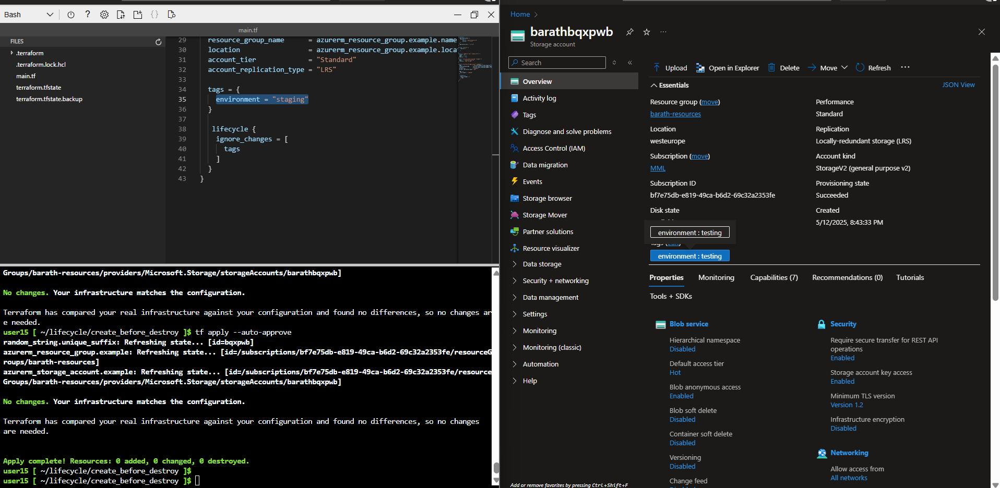

### Ignore changes

```
lifecycle {
    ignore_changes = [
      tags
    ]
  }
  ```

- I have included `ignore_changes` for `tags`, so if you change the tag manually, Terraform will not update it in the state file, and it won't attempt to modify the tag.

- In the `main.tf` file, the tag value is set to `staging`. I manually changed the tag to `testing` in the Azure Portal. When I ran `terraform apply`, it did not revert the tag back to "staging", because of the `ignore_changes` setting.

