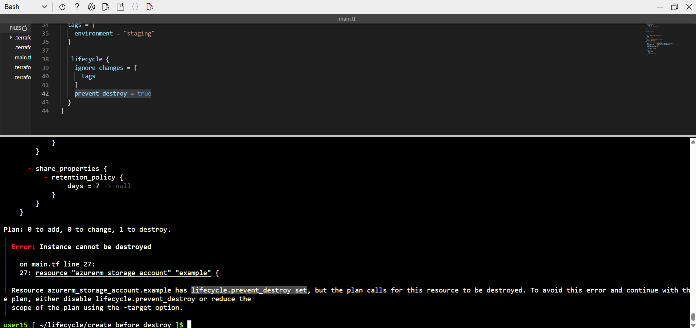

### Prevent destroy


```
lifecycle {
    ignore_changes = [
      tags
    ]
    prevent_destroy = true
  }
```

- In this block, I have added prevent_destroy = true. Even if someone tries to destroy the resource, Terraform will not allow it to be deleted, as shown in the image below.


